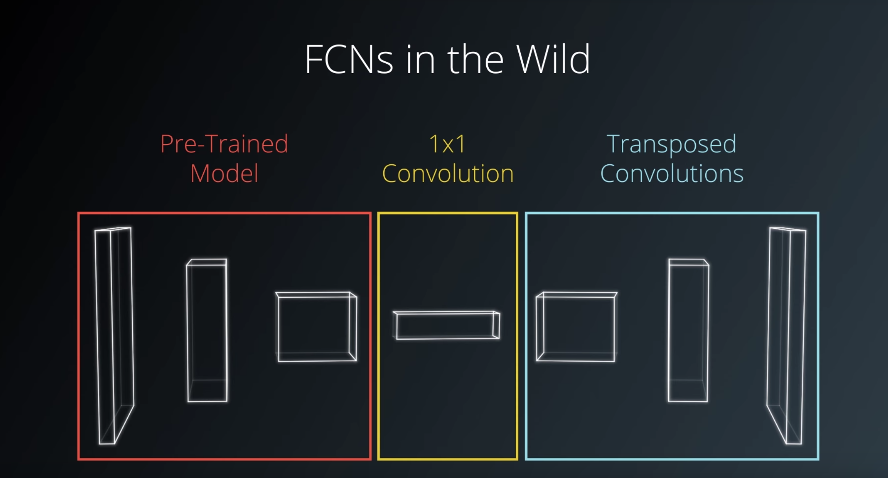
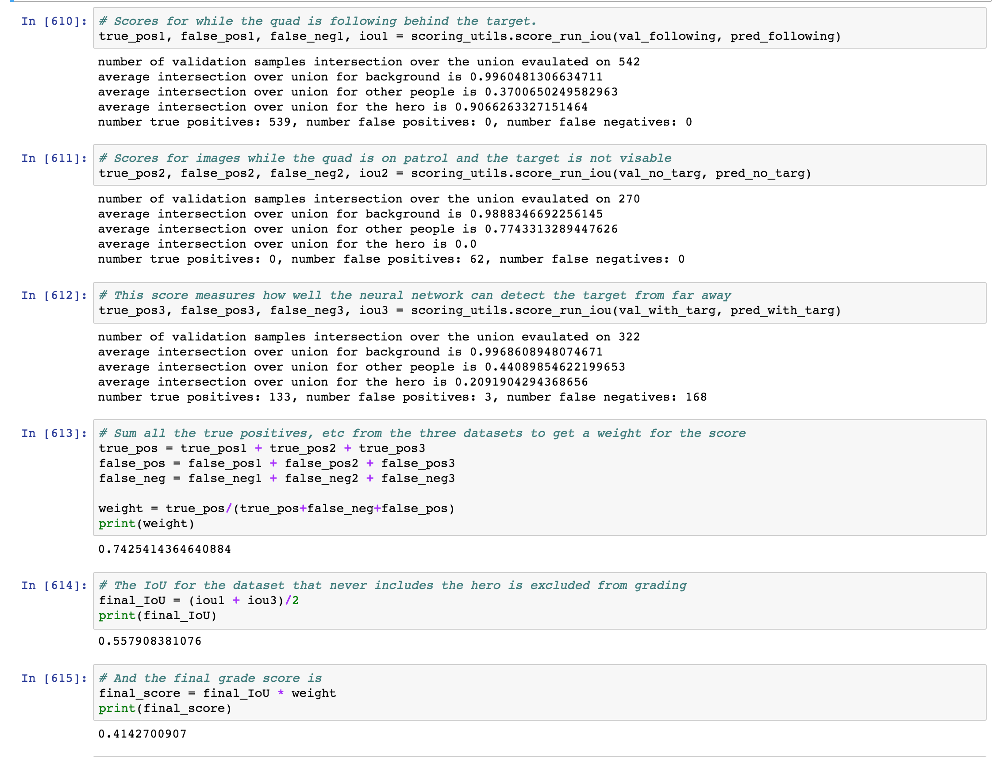

# Deep Learning
## Divya Patel

In this project we train a fully conventional network to find and track ("Follow") a target. In this case, we have identified our target as a person dressed in red. The person is on a specific path and the quadcopter will patrol on its on path until the target is identified and locked in. The idenfitication of the target and the ability to follow the target is based of of the model that we capture from our network training.

Here I show the picture of when I was training the network from a far distance. You can see green quadcopter patrol points, pink target movement path and blue spawn initial paths.

Convolution networks stack CONV (both normal and separable), POOL, and FC layers. Most convolution networks have smaller filters and deep architectures which we will be using today. I would like to try to use ResNet. I found that if I used a ResNet in the future, my error would be much smaller due to the multiplation of the derivative and the addition of that information back to it. I think there is less information lost and the network model is calculated much faster. You can see these two slides from Andrej Karpathy's lecture slides. I found his lectures extremely helpful to learn FCNs. 

On to our designed network. For this, I wanted to reduce the amount of data I used so I drove a small filter with a stride of two twice in the beggining to really reduce the amount of information before deepening the network. I increased the depth of the network by double the last encoder for the 1x1 because with many more choices, i felt the network could have a better chance of identifying the target. Of course, this slowed down my calculation a bit, but with AWS I didn't have much trouble. It increased my calculation time by about one third.

### Project Code
Here the Udacity helped coding of Separable Conv Batch Norm layers are used with same padding and ReLU activation.

For binlinear sampling, it was left as and upsampling of 2.

Then I have the encoder and decoder blocks as shown below. The encoder blocks are separable convolution using batch normilization and ReLu activation. I used four encoders. The second encoder did not increase the number of filters but I did want to reduce the data information for the training so I used the same encoder parameters as encoder 1 in order to do that. 

The decoder concatenated the previous layer with a larger layer and then pass that concatenated data to the convolution with batch norm and ReLu activation. 

Finally the softmax function is called to complete the FCN using same padding.
Here I have shown the full model in the screen shot both here in coding:

And here I have drawn out the architecture on paper.

Here is what the size of each layer looked like after running the convlutions and ReLu activations and then decoding back to softmax.

### Parameters

The next work after desgining the network architecture was to determine the parameters, at first I tested several parameters schemes by only adjusting the learning rate (.01,.001, .0001), the batch size (16, 32, 20, 25) and the number of epochs (50,100,200,250). 

The learning rate would lower the score of the program if it was too low or too high. I settled on .001 as .01 was causing the network to identify nothing and .0001 was too small of a learning rate to actual create any gradients.

The batch size affected both the validation error and also if the batch size was too small, I found that I wasn't really achieving any minama's for the validation error. This greatly affected my final score.

After multiple combinations of these I was still hitting around .38 for the score (which i will explain what the score means below). I was trying to achieve .40 or higher. I was finding that if I increased the number of steps per epoch, I would reduce the validation error very quickly per epoch. This would then reduce my number of epochs needed to run the architecture and create a decent model that would recognize the target and differentiate between target and other items/people.

### Images compared to ideal
Here are the comparisons for the images. These images are generated at random and the last image is my model tested on the image.

### Score and Charts

Althought I brute forced the parameters at the end using my intuition, I did get the best results my increasing the steps per epoch in order to quickly reduce the validation error. I think the number of epochs and images are inversly correlated to the steps per epoch and so I could reduce the number of epochs as my image set was constant.

I did get a good score with a smaller 3 layer encoding and 3 layer decoding network but wanted to try something that allowed me to reduce the size of my picture so I could see what would happen with processing time.

### Final Thoughts

I would most likely change my network to reflect more of a ResNet. If i was to stick to the convolution+ ReLu activation style of processing the data, I would change my network to not reduce the picture so much, I think it would be fine to have more data if I was on the AWS running all night. I would also reduce the size of my picture much more slowly to get more information and then process less steps on the epoch and more epochs in total to not overfit. I would get a better score I think if i did the same with my validation steps and after some thought and trials, I can see that validations steps is inversely porportional to the batch amount; which makes sense since you're validating the data rather than the steps per epoch it would be each batch. So I think I could have increased the validation steps if I reduced the batch size, but I didn't think about that while I was doing the experiment.

Overall, this project was fun and not too challenging as we used code from the semnatic segmentation exercise and we also have helper code by Udacity. I do think the lectures by Andrej Karpathy were extremely helpful, sometimes more so than the course so I would really recommend watching and taking notes from those lectures first and then going through the work on the udacity site.

